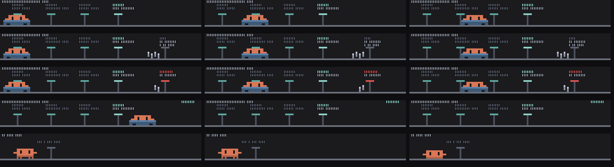

# clawd-commute

A Claude Code mod. Your git branch as a tram line above the prompt: each recent commit a station, Clawd rides between them; a push makes the tram depart. /clawd-commute toggles it.



*Preview frames rendered from the mod's own drawing code.*

**It won't use any of your usage.** Everything is drawn locally from code: no model calls, no tokens.

## Install

```
/plugin marketplace add saiharsha03/clawd-commute
/plugin install clawd-commute@clawd-commute
```

Or from a clone: `claude --plugin-dir ./clawd-commute`.

## Where it shows

In the band above the prompt, hidden until `/clawd-commute`. Terminal only.

## Commands

- `/clawd-commute`

## What the hooks do

`hooks/register.tsx` hooks: session.start, command.run{command=clawd-commute}, tool.call, ui.render{component=AbovePrompt}. It never blocks or rewrites a tool call or a prompt; it only watches them, draws, and answers its own commands.

## Privacy: what data it sends

Runs read-only `git` (rev-parse, log, status, rev-list) in your working folder. Nothing else leaves your machine.

## Licence

MIT. Clawd is Anthropic's Claude Code mascot; this is an unofficial fan mod.
